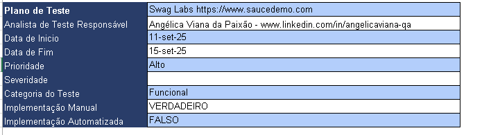
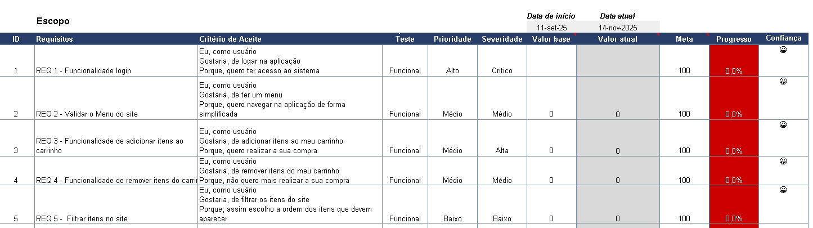
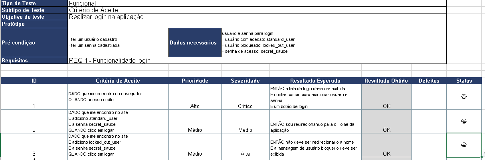
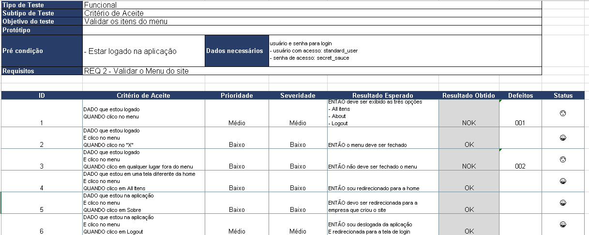
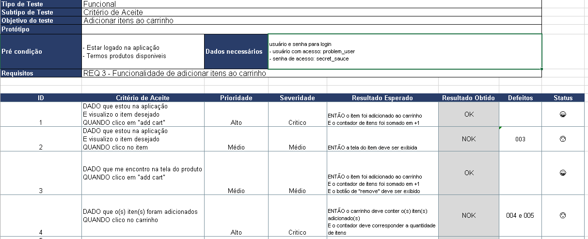
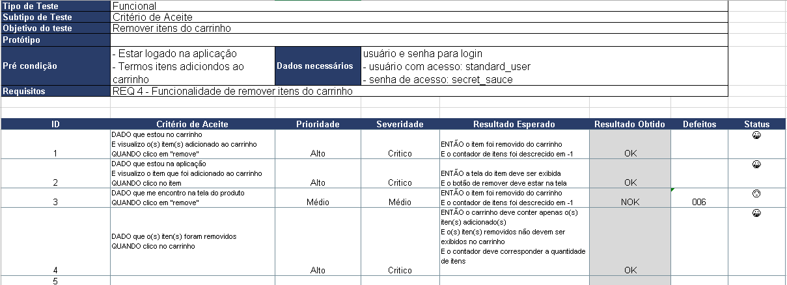
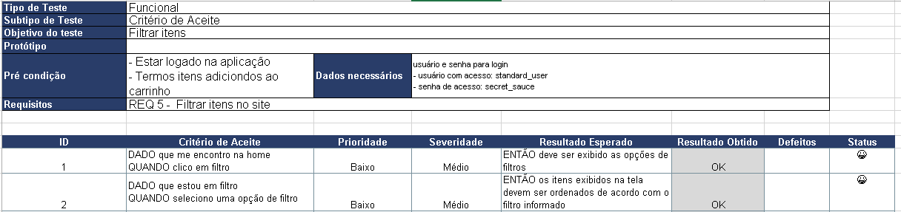
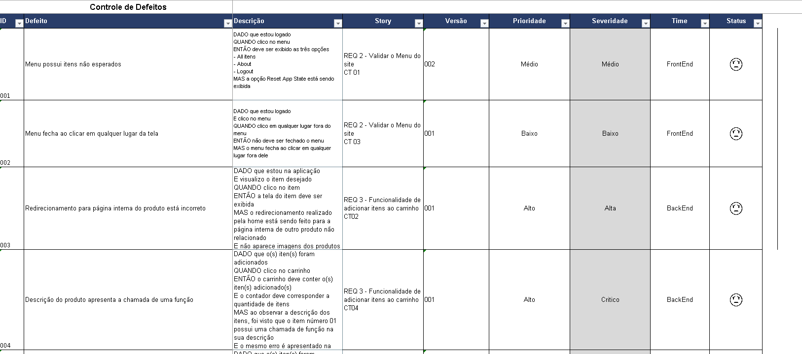
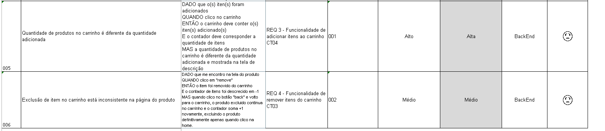

# Projeto Saucedemo

Este projeto foi criado com o propósito de praticar a criação e execução do **Plano de Teste** de um projeto. Onde foi levado em consideração analisar um site já existente, realizar levantamento dos seus requisitos, criação de suites e casos de teste para execução.

## Ferramentas

- Site utilizado para elaboração do Plano [Saucedemo] (https://www.saucedemo.com)

- Excel para criação do Plano de Teste

## Plano de Teste

### Apresentação do Plano

Na aba Introdução da Planilha irá conter todas as informações base do projeto.

### Apresentando Escopo

Na aba Escopo do Teste irá conter toda a abrangência das atividades de teste, especificando quais funcionalidades serão testadas, Critérios de aceite, Tipo de Teste, Prioridade, Severidade, Valor base, Valor atual, Meta, Progresso, Confiança.

### Apresentando Suite Login

Na aba Suite_Login irá conter todas as infomações necessárias para execução dos teste vinculadas a Suíte.

Entre elas:

-Tipo de Teste: Funcional
Subtipo de Teste: Critério de Aceite
- Objetivo do teste: Realizar login na aplicação
- Pré condição: Ter um usuário e senha cadastrados
- Dados necessários: usuário e senha para login
- Critérios de Aceite
- Prioridade
- Severidade
- Resultado Esperado
- Resultado Obtido
- Defeitos
- Status

### Apresentando Suite Validar Menu

Na aba validar_menu irá conter todas as infomações necessárias para execução dos teste vinculadas a Suíte.

Entre elas:

-Tipo de Teste: Funcional
Subtipo de Teste: Critério de Aceite
- Objetivo do teste: Validar os itens do menu
- Pré condição: Estar logado na aplicação.
- Dados necessários: usuário e senha para login (usuário com acesso: standard_user / senha de acesso: secret_sauce).

- Critérios de Aceite
- Prioridade
- Severidade
- Resultado Esperado
- Resultado Obtido
- Defeitos
- Status

### Apresentando Suite Adicionar Itens

Na aba adicionar_items irá conter todas as infomações necessárias para execução dos teste vinculadas a Suíte.

Entre elas:

-Tipo de Teste: Funcional
Subtipo de Teste: Critério de Aceite
- Objetivo do teste: Adicionar itens do carrinho
- Pré condição: Estar logado na aplicação e ter produtos disponiveis.
- Dados necessários: usuário e senha para login (usuário com acesso: problem_user / senha de acesso: secret_sauce).

- Critérios de Aceite
- Prioridade
- Severidade
- Resultado Esperado
- Resultado Obtido
- Defeitos
- Status

### Apresentando Suite Remover Itens

Na aba remover_itens irá conter todas as infomações necessárias para execução dos teste vinculadas a Suíte.

Entre elas:

-Tipo de Teste: Funcional
Subtipo de Teste: Critério de Aceite
- Objetivo do teste: Remover itens do carrinho
- Pré condição: Estar logado na aplicação e ter itens adicionados ao carrinho.
- Dados necessários: usuário e senha para login (usuário com acesso: problem_user / senha de acesso: secret_sauce).

- Critérios de Aceite
- Prioridade
- Severidade
- Resultado Esperado
- Resultado Obtido
- Defeitos
- Status

### Apresentando Suite Filtrar Itens

Na aba filtrar_itens irá conter todas as infomações necessárias para execução dos teste vinculadas a Suíte.

Entre elas:

-Tipo de Teste: Funcional
Subtipo de Teste: Critério de Aceite
- Objetivo do teste: Filtrar itens
- Pré condição: Estar logado na aplicação e ter itens adicionados ao carrinho.
- Dados necessários: usuário e senha para login (usuário com acesso: standard_user / senha de acesso: secret_sauce).

- Critérios de Aceite
- Prioridade
- Severidade
- Resultado Esperado
- Resultado Obtido
- Defeitos
- Status

### Apresentando Controle de Bugs

Na Planilha controle de bugs irá conter todas as infomações necessárias para controle dos defeitos encontrados vinculados as Suítes de Testes acima.

Entre elas:

-ID: Número de ID que está vinculado com o mesmo número encontrado na coluna "defeito" nas suítes de testes.
- Defeito: Nome do defeito encontrado.
- Descrição: Descrição clara e objetiva do defeito encontrado.
- Story: Qual funcionalidade e cenário de teste, já vinculando a evidência.
- Versão: Qual versão se encontra o projeto.

- Prioridade
- Severidade
- Time
- Status

